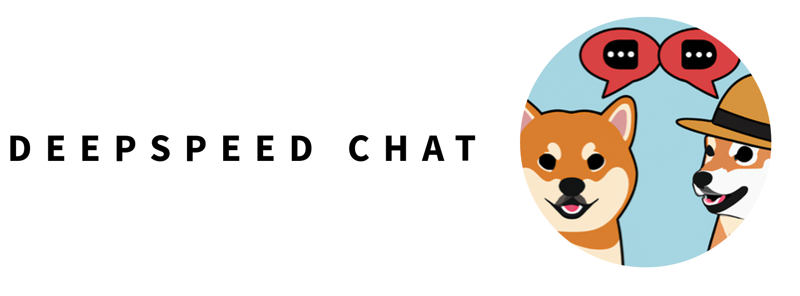
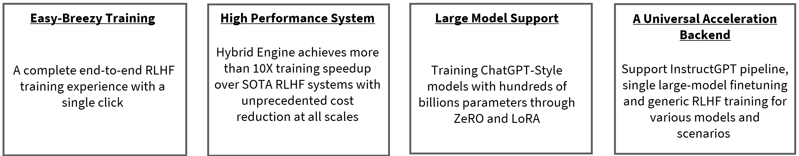
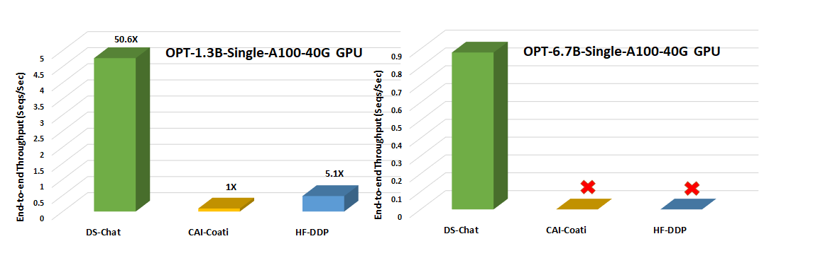
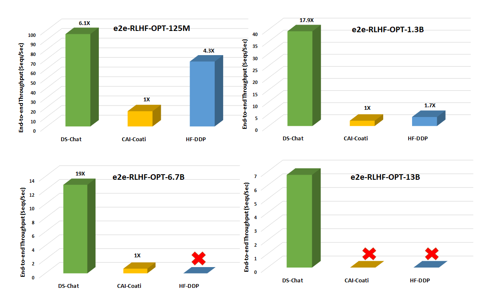
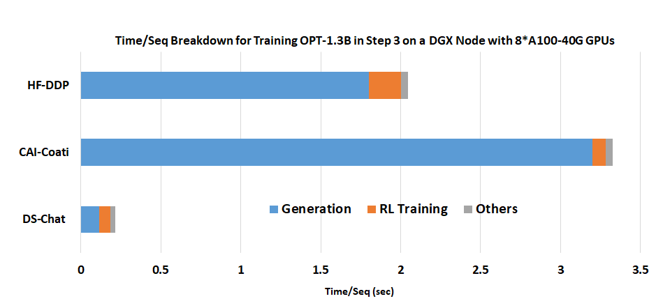

<p align="center">



</p>

<div align="center">

## 🐕DeepSpeed-Chat: Easy, Fast and Affordable RLHF Training of ChatGPT-like Models at All Scales🐕

</div>

<div align="center">


[](LICENSE)

</div>


A fast, affordable, scalable and open system framework for enabling end-to-end Reinforcement Learning Human Feedback (RLHF) training experience to generate high-quality ChatGPT-style models at all scales.


<div align="center">



</div>

<!-- Three language version (Eng/Chinese/Japanese)  -->


<!-- markdown-toc start - Don't edit this section. Run M-x markdown-toc-refresh-toc -->
## Table of Contents

- [🐕DeepSpeed-Chat: Easy, Fast and Affordable RLHF Training of ChatGPT-like Models at All Scales🐕](#deepspeed-chat-easy-fast-and-affordable-rlhf-training-of-chatgpt-like-models-at-all-scales)
- [Table of Contents](#table-of-contents)
- [📰 Latest News 📰](#-latest-news-)
- [🚀 What is DeepSpeed Chat 🚀](#-what-is-deepspeed-chat-)
- [🧨 Capabilities 🧨](#-capabilities-)
- [☕ Quick Start ☕](#-quick-start-)
  - [🐼 Installation](#-installation)
  - [🐼 One Single Script Completes All Three Steps of RLHF Training and Generate Your First ChatGPT Model](#-one-single-script-completes-all-three-steps-of-rlhf-training-and-generate-your-first-chatgpt-model)
  - [🐼 Demonstration: Individual Step Fine-Tuning](#-demonstration-individual-step-fine-tuning)
    - [🕐 Step 1 - Supervised Fine-Tuning](#-step-1---supervised-fine-tuning)
    - [🕑 Step 2 - Reward Model](#-step-2---reward-model)
    - [🕒 Step 3 - Reinforcement Learning with Human Feedback](#-step-3---reinforcement-learning-with-human-feedback)
  - [🐼 Adding and using your own datasets in DeepSpeed-Chat](#-adding-and-using-your-own-datasets-in-deepspeed-chat)
  - [🐼 Customizing your own RLHF training pipeline using DeepSpeed-Chat’s RLHF APIs](#-customizing-your-own-rlhf-training-pipeline-using-deepspeed-chats-rlhf-apis)
  - [🐼 Serving: Plug-in your final model trained by DeepSpeed-Chat and test it out!](#-serving-plug-in-your-final-model-trained-by-deepspeed-chat-and-test-it-out)
- [🔥 Training Performance Evaluation 🔥](#-training-performance-evaluation-)
  - [🐲 Superior Model Scale and Low Training Cost](#-superior-model-scale-and-low-training-cost)
  - [🐲 Throughput and Model Size Scalability Comparisons with Existing RLHF Systems](#-throughput-and-model-size-scalability-comparisons-with-existing-rlhf-systems)
- [😽 Supported Models 😽](#-supported-models-)
- [🔬 Build Pipeline Status 🔬](#-build-pipeline-status-)
- [⚓ Documentation and Tutorial ⚓](#-documentation-and-tutorial-)
- [🌱 DeepSpeed Chat's Roadmap 🌱](#-deepspeed-chats-roadmap-)
- [💬 DeepSpeed Chat and DeepSpeed Community 💬](#-deepspeed-chat-and-deepspeed-community-)
- [🙏 Acknowledgement and Citation 🙏](#-acknowledgement-and-citation-)

<!-- markdown-toc end -->

## 📰 Latest News 📰

* ***[2023/08] 🚀 [DeepSpeed-Chat: Llama/Llama-2 system support, efficiency boost, and training stability improvements](https://github.com/deepspeedai/DeepSpeed/tree/master/blogs/deepspeed-chat/ds-chat-release-8-31/README.md)*** 🚀

* ***[2023/04] [DeepSpeed Chat: Easy, Fast and Affordable RLHF Training of ChatGPT-like Models at All Scales](https://github.com/deepspeedai/DeepSpeed/tree/master/blogs/deepspeed-chat)*** [[English](https://github.com/deepspeedai/DeepSpeed/tree/master/blogs/deepspeed-chat/README.md)] [[中文](https://github.com/deepspeedai/DeepSpeed/tree/master/blogs/deepspeed-chat/chinese/README.md)] [[日本語](https://github.com/deepspeedai/DeepSpeed/tree/master/blogs/deepspeed-chat/japanese/README.md)]

To cite DeepSpeed Chat, please cite our [arxiv report](https://arxiv.org/abs/2308.01320):

```
@article{yao2023dschat,
  title={{DeepSpeed-Chat: Easy, Fast and Affordable RLHF Training of ChatGPT-like Models at All Scales}},
  author={Zhewei Yao and Reza Yazdani Aminabadi and Olatunji Ruwase and Samyam Rajbhandari and Xiaoxia Wu and Ammar Ahmad Awan and Jeff Rasley and Minjia Zhang and Conglong Li and Connor Holmes and Zhongzhu Zhou and Michael Wyatt and Molly Smith and Lev Kurilenko and Heyang Qin and Masahiro Tanaka and Shuai Che and Shuaiwen Leon Song and Yuxiong He},
  journal={arXiv preprint arXiv:2308.01320},
  year={2023}
}
```

## 🚀 What is DeepSpeed Chat 🚀

<div align="center">

https://user-images.githubusercontent.com/124002815/230290966-a78ea171-ab65-4fcc-b91e-67c7c4403497.mp4

</div>

In the spirit of democratizing ChatGPT-style models and their capabilities, DeepSpeed is proud to introduce a general system framework for enabling an end-to-end training experience for ChatGPT-like models, named ***DeepSpeed Chat***. It can automatically take your favorite pre-trained large language models through an OpenAI InstructGPT style three stages to produce your very own high-quality ChatGPT-style model. DeepSpeed Chat makes training for high-quality ChatGPT-style models easy, fast, affordable and scalable.

With just one click, you can train, generate and serve a 1.3 billion parameter ChatGPT model within 1.36 hours on a single consumer-grade NVIDIA A6000 GPU with 48GB memory. On a single DGX node with 8 NVIDIA A100-40G GPUs, DeepSpeed-Chat enables training for a 13 billion parameter ChatGPT model in 13.6 hours. On multi-GPU multi-node systems (cloud scenarios),i.e., 8 DGX nodes with 8 NVIDIA A100 GPUs/node, DeepSpeed-Chat can train a 66 billion parameter ChatGPT model in under 9 hours. Finally, it enables 15X faster training over the existing RLHF systems, and can handle training of ChatGPT-like models with over 200 billion parameters: another impossible feat with the existing systems. For the full range of discussion on various model sizes and low training costs enabled by DeepSpeed-Chat, please refer to the [Release Blog](https://github.com/deepspeedai/DeepSpeed/tree/master/blogs/deepspeed-chat) and [Training Performance Evaluation](#-training-performance-evaluation-).  

Beyond this release, DeepSpeed system has been proudly serving as the system backend for accelerating a range of ongoing efforts for fast training/fine-tuning Chat-Style models (e.g., LLaMA). The following are some of the open-source examples that are powered by DeepSpeed:

- [Databricks Dolly](https://github.com/databrickslabs/dolly)
- [LMFlow](https://github.com/OptimalScale/LMFlow)
- [CarperAI-TRLX](https://github.com/CarperAI/trlx)
- [Huggingface-PEFT](https://github.com/huggingface/peft)


## 🧨 Capabilities 🧨

DeepSpeed Chat is evolving fast to accommodate the increasing demand for system-level acceleration support for training/finetuning as well as serving emerging models. Please stay tuned with our upcoming milestones at [Roadmap](#-deepspeed-chats-roadmap-).

A summary of DeepSpeed Chat includes:

+ **DeepSpeed Chat**: a complete end-to-end three-stage OpenAI InstructGPT training strategy with Reinforcement Learning Human Feedback (RLHF), to generate high-quality ChatGPT-style models from users’ favorite pre-trained large language model checkpoints;
+ **DeepSpeed Hybrid Engine**: A new system support for fast, affordable and scalable RLHF training at All Scales. It is built upon your favorite DeepSpeed's system capability such as ZeRO technologies and DeepSpeed-Inference;
+ **Easy-breezy Training Experience**: A single script capable of taking a pre-trained Huggingface model and running it through all three steps of the RLHF training.  
+ **A Universal System Support for Today’s ChatGPT-like Model Training**: DeepSpeed Chat can serve as the system backend for not only the 3-step instruct-base RLHF pipeline, but also the current single model finetuning exploration (e.g., LLaMA-centric finetuning) and generic RLHF training for various models and scenarios.

Please check out our [Blog Release](https://github.com/deepspeedai/DeepSpeed/tree/master/blogs/deepspeed-chat) and [Documentation and Tutorial](#-documentation-and-tutorial-) for more details on our training methodology and new system technologies.


## ☕ Quick Start ☕


### 🐼 Installation


```bash
pip install deepspeed>=0.9.0

git clone https://github.com/deepspeedai/DeepSpeedExamples.git
cd DeepSpeedExamples/applications/DeepSpeed-Chat/
pip install -r requirements.txt
pip install -e .
```

### 🐼 One Single Script Completes All Three Steps of RLHF Training and Generate Your First ChatGPT Model


&nbsp;&nbsp;**:yellow_heart: DeepSpeed-Chat’s RLHF Example 1: Coffee Time Training for a 1.3B ChatGPT Model**


<details><summary> Expand </summary><p>
If you only have around **1-2 hour** for coffee or lunch break, you can also try to train a small/toy model with DeepSpeed-Chat. For example, we prepared a training example for a **1.3B** model with a single dataset to test our framework on your consumer-grade GPUs. The best part is that you will have your model checkpoint ready to play with when you are back from your lunch break!

  ```bash
  python e2e_rlhf.py --actor-model facebook/opt-1.3b --reward-model facebook/opt-350m --deployment-type single_gpu
  ```

  See the following table for the E2E time breakdown for training a 1.3 billion parameter ChatGPT model via DeepSpeed-Chat on a single commodity NVIDIA A6000 GPU with 48GB memory.

  | Model Size (A6000-48G)            | Step 1  | Step 2  | Step 3 | Total  |
  | --------------------------------- | ------- | ------- | ------ | ------ |
  | Actor: OPT-1.3B  Reward: OPT-350M | 2900 Sec | 670 Sec | 1.2hr | 2.2hr |

 </p></details>


&nbsp;&nbsp;**:green_heart: DeepSpeed-Chat’s RLHF Example 2: Half Day Training on a Single Commodity GPU Node for a 13B ChatGPT Model**

<details><summary> Expand </summary><p>

If you only have around **half a day** and only a single server node, we suggest using an example of pretrained **OPT-13B** as the actor model and OPT-350M as the reward model in the following single script to generate a final 13B ChatGPT-style model:

  ```bash
  python e2e_rlhf.py --actor-model facebook/opt-13b --reward-model facebook/opt-350m --deployment-type single_node
  ```

  See the following table for the E2E time breakdown for training a 13 billion parameter ChatGPT model via DeepSpeed-Chat on a single DGX node with 8 NVIDIA A100-40G GPUs.

  | Model Size (A100-40G)          | Step 1 | Step 2 | Step 3 | Total  |
  | ------------------------------- | ------ | ------ | ------ | ------ |
  | Actor: OPT-13B Reward: OPT-350M | 2.5hr  | 0.25hr | 10.8hr | 13.6hr |

</p></details>


&nbsp;&nbsp;**:blue_heart: DeepSpeed-Chat’s RLHF Example 3: Low-Budget Cloud Training for a Larger 66B ChatGPT Model**

<details><summary> Expand </summary><p>

Want to try different model sizes and configurations? You got it! With DeepSpeed-Chat, users can easily do that. For example, if you have access to multi-nodes cluster or cloud resources and prefer to train a larger and higher-quality model for your research or business, you can simply use a similar script with your desired model sizes, e.g., **66B** and GPU counts=64:

  ```bash
  python e2e_rlhf.py --actor-model facebook/opt-66b --reward-model facebook/opt-350m --deployment-type multi_node
  ```

  See the following table for E2E time breakdown for training a 66 billion parameter ChatGPT model via DeepSpeed-Chat on 8 DGX nodes with 8 NVIDIA A100-80G GPUs/node.

  | Model Size (A100-80g)            | Step 1 | Step 2 | Step 3 | Total |
  | -------------------------------- | ------ | ------ | ------ | ----- |
  | Actor: OPT-66B  Reward: OPT-350M | 82mins | 5mins  | 7.5hr  | 9hr   |
 </p></details>

 For your detailed budgeting for training a wide spectrum of model sizes on potentially available computing resources (e.g., Microsoft Azure), please visit [Training Performance Evaluation](#-training-performance-evaluation-).

### 🐼 Demonstration: Individual Step Fine-Tuning

The train.py script has an easy-to-use command-line interface and can be launched with several arguments including model type, model size, and number of GPUs to run. Considering users who would like to use DeepSpeed-Chat to only fine-tune their pretrained models in Step 1 or 2, or just use their own actor and reward model checkpoints directly to perform Step 3 in our RLHF pipeline, DeepSpeed-Chat provides greater configurability and flexibility to accommodate individual step fine-tuning:

#### 🕐 Step 1 - [Supervised Fine-Tuning](./training/step1_supervised_finetuning)

<details><summary> Expand </summary><p>

```bash
# Move into the first step of the pipeline
cd training/step1_supervised_finetuning/

# Run the training script
bash training_scripts/opt/single_gpu/run_1.3b.sh

# Evaluate the model
bash evaluation_scripts/run_prompt.sh
```

</p></details>

#### 🕑 Step 2 - [Reward Model](./training/step2_reward_model_finetuning)

<details><summary> Expand </summary><p>

```bash
# Move into the second step of the pipeline
cd training/step2_reward_model_finetuning

# Run the training script
bash training_scripts/opt/single_gpu/run_350m.sh

# Evaluate the model
bash evaluation_scripts/run_eval.sh
```

</p></details>

#### 🕒 Step 3 - [Reinforcement Learning with Human Feedback](./training/step3_rlhf_finetuning)

<p align="center">


Figure 1: The illustration of DeepSpeed Chat’s RLHF training pipeline with optional features.


</p>

As the most complex step of the entire 3-step InstructGPT pipeline, DeepSpeed Chat's ***Hybrid Engine*** has enabled sufficient acceleration to avoid large training time (cost) implications. Refer to [Step3: Reinforcement Learning Human Feedback (RLHF)](./training/step3_rlhf_finetuning) for more information. If you already have your fine-tuned actor and reward model checkpoints, you can simply run the following scripts to enable the PPO training.

<details><summary> Expand </summary><p>

```bash
# Move into the final step of the pipeline
cd training/step3_rlhf_finetuning/

# Run the training script
bash training_scripts/opt/single_gpu/run_1.3b.sh
```
</p></details>


### 🐼 Adding and using your own datasets in DeepSpeed-Chat
In addition to the datasets used in our example scripts, you can also add and use your own datasets. To do so, first you need to add a new Class in [dschat/utils/data/raw_datasets.py](https://github.com/deepspeedai/DeepSpeedExamples/blob/master/applications/DeepSpeed-Chat/dschat/utils/data/raw_datasets.py) to define the format when using your data. You need to make sure to follow the APIs and format defined in the PromptRawDataset class to ensure a consistent data format that DeepSpeed-Chat relies on. You can look at the existing classes to learn how to do so.

Second, you need to add an if condition in function get_raw_dataset in [dschat/utils/data/data_utils.py](https://github.com/deepspeedai/DeepSpeedExamples/blob/master/applications/DeepSpeed-Chat/dschat/utils/data/data_utils.py) corresponding to your new dataset. The dataset_name string in the if condition should be the dataset name you will provide as a arg for the training scripts. Last, you need to add your new dataset's dataset_name into your "--data_path" arg in your training scripts.  
If you have downloaded huggingface datasets manually, you can add your local path into "--data_path", such as "--data_path ./relative/Dahoas/rm-static" and "--data_path /absolute/Dahoas/rm-static". Remember you should not make `data/` in your local path, it may cause an exception to `load_dataset`.

One thing to note is that some datasets may only have one response instead of two responses. For those datasets, you can only use them in step 1. And in such case, you should add the dataset_name as part of the "--sft_only_data_path" arg instead of the "--data_path" arg. One thing to note is that: If you plan to only do step 1 SFT, adding more single-response datasets is definitely beneficial. However, if you do plan to do steps 2 and 3, then adding too many single-response datasets during SFT could backfire: these data could be different from the data used for steps 2/3, generating different distributions which could cause training instability/worse model quality during step 2/3. That is part of the reason why we focused on trying the datasets with two responses and the preference, and always split a dataset into all 3 steps.

If you have your own dataset in local files, you can also use it by following these rules:
* Pass "local/jsonfile" as the dataset name to the "--data_path" argument.
* Put your train data and evaluation data in applications/DeepSpeed-Chat/data/ with name train.json and eval.json.
* The json data in file should be a single list with each item like ***{"prompt": "Human: I have a question. Assistant:", "chosen": "Good answer.", "rejected": "Bad answer."}***.

What is more, when you use your own dataset files and modify some data in them, pay attention to the parameter "reload" of ***create_prompt_dataset*** function. You should pass a True value to it or the cache files will not refresh.

### 🐼 Customizing your own RLHF training pipeline using DeepSpeed-Chat’s RLHF APIs

DeepSpeed-Chat allows users to build their very own RLHF training pipeline using our flexible APIs shown below, which users can use to reconstruct their own RLHF training strategy. This enables a general interface and backend for creating a wide range of RLHF algorithms for research exploration.

```python
engine = DeepSpeedRLHFEngine(
  actor_model_name_or_path=args.actor_model_name_or_path,
  critic_model_name_or_path=args.critic_model_name_or_path,
  tokenizer=tokenizer,
  num_total_iters=num_total_iters,
  args=args)

trainer = DeepSpeedPPOTrainer(engine=engine, args=args)

for prompt_batch in prompt_train_dataloader:
  out = trainer.generate_experience(prompt_batch)
  actor_loss, critic_loss = trainer.train_rlhf(out)

```

### 🐼 Serving: Plug-in your final model trained by DeepSpeed-Chat and test it out!
For quickly testing your final models trained by DeepSpeed-Chat, we provide a simple script below. For users who want to use our trained models to create different LLM applications such as personal assistant, chatbot and code understanding, please refer to [LangChain](https://github.com/hwchase17/langchain).

```bash
# serve the final model
python chat.py --path  ${PATH-to-your-actor-model}
```
***Example 1: Q&A Session from serving a 1.3B final model trained from DeepSpeed-Chat***


<div align="center">


</div>


***Example 2: Multi-Round Conversations from serving a model trained from DeepSpeed-Chat***


<div align="center">


</div>


## 🔥 Training Performance Evaluation 🔥

### 🐲 Superior Model Scale and Low Training Cost

A comprehensive view of the scale and end-to-end training times enabled by DeepSpeed-RLHF system are presented in Table 1. It also demonstrates the most cost-effective way to train models in Azure Cloud along with the associated cost.


| GPU SKUs      | OPT-1.3B      | OPT-6.7B       | OPT-13.2B       | OPT-30B       | OPT-66B           | OPT-175B      |
|---------------|---------------|----------------|-----------------|---------------|-------------------|-----------------|
| 1x V100 32G   | 1.8 days      |                |                 |               |                   |                 |
| 1x A6000 48G  | 1.1 days      | 5.6 days       |                 |               |                   |                 |
| 1x A100 40G   | 15.4 hrs      | 3.4 days       |                 |               |                   |                 |
| 1x A100 80G   | 11.7 hrs      | 1.7 days       | 4.9 days        |               |                   |                 |
| 8x A100 40G   | 2 hrs         | 5.7 hrs        | 10.8 hrs        | 1.85 days     |                   |                 |
| 8x A100 80G   | 1.4 hrs($45)  | 4.1 hrs ($132) | 9 hrs ($290)    | 18 hrs ($580) | 2.1 days ($1620)  |                 |
| 64x A100 80G  | 31 minutes    | 51 minutes     | 1.25 hrs ($320) | 4 hrs ($1024) | 7.5 hrs ($1920)    | 20 hrs ($5120) |
<p align="center">
Table 1. End-to-end RLHF training (Step 3) for different actor model sizes and a fixed 350M critical model running on hardware ranging from single consumer grade GPU (NVIDIA A6000) to a more powerful cloud setup (64xA100-80GPUs).  
</p>

<details><summary> ⭕ Very Important Experimental Setup Details ⭕</summary><p>

The numbers in the table above are for Stage 3 of the training and based on actual measured training throughput on DeepSpeed-RLHF curated dataset and training recipe which trains for one epoch on a total of 135M tokens (6 open-sourced datasets with 40% used for RLHF training stage, i.e., Dahoas/rm-static, Dahoas/full-hh-rlhf, Dahoas/synthetic-instruct-gptj-pairwise, yitingxie/rlhf-reward-datasets, openai/webgpt_comparisons, and stanfordnlp/SHP from Huggingface Datasets. More specifically, we have in total 67.5M query tokens (131.9k queries with sequence length 256) and 67.5M generated tokens (131.9k answers with sequence length 256), and a maximum global batch size per step of 0.5M tokens (1024 query-answer pairs). We urge readers to pay attention to these specifications before making any cost and e2e time comparisons with DeepSpeed-RLHF.

 </p></details>


### 🐲 Throughput and Model Size Scalability Comparisons with Existing RLHF Systems

&nbsp;&nbsp;***(I) Single-GPU's Model Scale and Throughput Comparison***

&nbsp;&nbsp;With over an order of magnitude higher throughput, DeepSpeed-Chat unlocks the ability to train significantly larger actor models under the same latency budget or train models of similar size at much lower cost, compared to the existing systems like Colossal-AI or HuggingFace-DDP. For example, on a single GPU, DeepSpeed enables over **10X** throughput improvement for RLHF training on a single GPU. While both CAI-Coati and HF-DDP can run a max model size of 1.3B, DeepSpeed can run 6.5B model on the same hardware, **5x** higher.  

<p align="center">


Figure 2: Step 3 throughput comparison against two other system frameworks (Colossal AI's Coati and Huggingface-DDP) for accelerating RLHF training on a single NVIDIA A100-40G commodity GPU. No icons represent OOM scenarios.  

</p>

&nbsp;&nbsp;***(II) Single-Node Multi-GPU Model Scale and Throughput Comparison***

On multi-GPUs of a single node, DeepSpeed-Chat enables **6-19X** speedup over CAI-Coati and **1.4-10.5X** speedup over HF-DDP (Figure 3) with respect to system throughput.  

<p align="center">


Figure 3. End-to-end training throughput comparison for step 3 of the training pipeline (the most time consuming portion) with different model sizes on a single DGX node equipped with 8 NVIDIA A100-40G GPUs. No icons represent OOM scenarios.  

</p>

&nbsp;&nbsp;***(III) Superior Generation Phase Acceleration in Step3***

One of the key reasons that result in Figure 3 is our Hybrid Engine's superior generation phase acceleration, shown below.

<p align="center">



Figure 4. Superior generation phase acceleration from DeepSpeed Chat’s Hybrid Engine: A time/sequence breakdown for training OPT-1.3B actor model + OPT-350M reward model on a single DGX node with 8 A100-40G GPUs.

</p>

For other detailed results and in-depth analysis, including effective throughput and scalability of DeepSpeed-Chat, please refer to our [Blog Post](https://github.com/deepspeedai/DeepSpeed/tree/master/blogs/deepspeed-chat).

## 😽 Supported Models 😽

Currently, we support the following model families. We will continue to grow over time to include emerging models for ChatGPT-style training! See [Roadmap](#-deepspeed-chats-roadmap-) for more details.

model family | size range | details
------ | ------ | -------
[opt](https://huggingface.co/models?other=opt) | 0.1B - 66B  | Extensive performance and accuracy tests have been performed.
[llama2](https://huggingface.co/models?sort=trending&search=meta-llama%2FLlama-2) | 7B, 13B  | We provide full system support and scripts to try 7B and 13B models.*
[llama2-70b](https://huggingface.co/models?sort=trending&search=meta-llama%2FLlama-2-70b) | 70B  | Llama-2-70B is supported through MixZ++, ZeRO-Offload but not Hybrid Engine.
[bloom](https://huggingface.co/models?other=bloom) | 0.3B - 176B  | Please create your own scripts. We welcome contributions :)
[gpt\_neox](https://huggingface.co/models?other=gpt_neox) | 1.3B - 20B | "
[gptj](https://huggingface.co/models?other=gptj) | 1.4B - 6B | "
[gpt\_neo](https://huggingface.co/models?other=gpt_neo) | 0.1B - 2.7B | "
[gpt2](https://huggingface.co/models?other=gpt2) | 0.3B - 1.5B |  "
[codegen](https://huggingface.co/Salesforce/codegen-16B-multi) | 0.35b - 16B | "

* To create a new model training recipe/script, please see our training_scripts folder that contains opt and llama2 scripts. Please note that Llama-2 models have not been fully trained but the scripts have been tested for all the system optimizations including DeepSpeed ZeRO Stage 3, Hybrid Engine, MixZ++, and LoRA. We invite users to try out the Llama-2 scripts and share the results with the community via GitHub and HuggingFace model hub.


## 🔬 Build Pipeline Status 🔬

| Description | Status |
| ----------- | ------ |
| Integrations | [](https://github.com/deepspeedai/DeepSpeed/actions/workflows/nv-ds-chat.yml) |

A DeepSpeed CI workflow runs the DeepSpeed-Chat Step 3 pipeline nightly across the following test configurations:

Models
```
Actor:  facebook/opt-125m
Critic: facebook/opt-125m (trained in DS-Chat Step 2)
```

Parameters comprising test matrix
```
Zero Stage:    2, 3
Hybrid Engine: True, False
Offload:       True, False
LoRA:          True, False
```

Each configuration (16 total) runs through a limited number of Step 3 non-overflow training steps (i.e. steps where neither actor nor critic overflow) and saves the actor/critic models.
Assertions are used to check if the training pipeline executed correctly and if the actor and critic models were saved properly.


## ⚓ Documentation and Tutorial ⚓

For more APIs, example scripts, and evaluation results, please refer to
  - [**Step1: Supervised Fine-Tuning (SFT)**](./training/step1_supervised_finetuning/README.md)
  - [**Step2: Reward Model Fine-Tuning**](./training/step2_reward_model_finetuning/README.md)
  - [**Step3: Reinforcement Learning Human Feedback (RLHF)**](./training/step3_rlhf_finetuning/README.md)
  - [**Training Details Explanation**](./training/README.md)

## 🌱 DeepSpeed Chat's Roadmap 🌱


Our future plan includes but not limited to :
- [ ] Hybrid Engine Support for Llama-2-70B
- [ ] Generalizing DeepSpeed-RLHF abstraction and system support for a wide range of RL algorithms/paradigms
- [ ] Auto-tuning of system optimizations

## 💬 DeepSpeed Chat and DeepSpeed Community 💬

Just like how the success of [the BLOOM model](https://huggingface.co/bigscience/bloom) was supported by both [DeepSpeed Team](https://github.com/bigscience-workshop/Megatron-DeepSpeed) and many [open source contributors](https://huggingface.co/bigscience), we welcome all AI developers/practitioners/researchers to join this on-going effort for DeepSpeed-Chat. To participate:
- Show your support by leaving a star ⭐ to our [DeepSpeed](https://github.com/deepspeedai/DeepSpeed) and [DeepSpeedExamples](https://github.com/deepspeedai/DeepSpeedExamples) GitHub repositories.
- Follow us on [twitter](https://twitter.com/MSFTDeepSpeed) to get notified about our latest news. For Chinese users, you can also follow our [Chinese Zhihu account](https://www.zhihu.com/people/deepspeed). For Japanese users, you can also follow our [Japanese twitter account](https://twitter.com/MSFTDeepSpeedJP).
- Currently we prefer to interact with open source users mainly on GitHub so that it's easier for all users to search for related information. For bug reports, please submit a GitHub issue. For contribution, please submit a pull request (PR). For general question/discussion, please open a new discussion or join any existing discussions.
- We are open to collaborations with universities, research labs, and companies, such as working together on deep learning research, applying DeepSpeed to empower real-world AI models and applications, and so on. For such requests (and other requests unsuitable for GitHub), please directly email to deepspeed-info@microsoft.com.


## 🙏 Acknowledgement and Citation 🙏

We thank the following papers and open-source repositories:

    [1] Schulman, John, et al. "Introducing ChatGPT", https://openai.com/blog/chatgpt (2022).
    [2] Ouyang, Long, et al. "Training language models to follow instructions with human feedback." arXiv preprint arXiv:2203.02155 (2022). This is also referred as InstructGPT
    [3] Stiennon, Nisan, et al. "Learning to summarise with human feedback." Advances in Neural Information Processing Systems 33 (2020): 3008-3021.
    [4] Transformers Hugging Face (github.com)
    [5] CarperAI, https://github.com/CarperAI/trlx
    [6] lvwerra/trl: Train transformer language models with reinforcement learning. (github.com)
    [7] pg-is-all-you-need/02.PPO.ipynb at master · MrSyee/pg-is-all-you-need (github.com)
