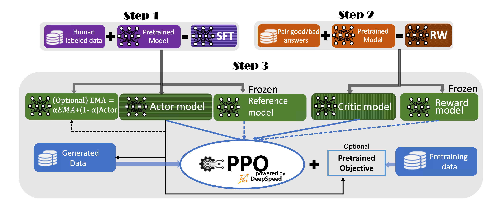

# 🐕 Reinforcement Learning from human feedback (RLHF) finetuning



There are two main challenges here:

* 😵 How to handle the large memory consumption used for multiple models?
* 😵 How can one efficiently generate answers as it typically dominates the training cost in RLHF?

Here, we will provide a brief answer to both questions.

#### 🚀 **Memory management in DeepSpeed-RLHF**

We have three key techniques to reduce the memory pressure for RLHF finetuning.

- ☀️ First, thanks to DeepSpeed ZeRO optimization, we can partition both the model parameters and optimizers across the entire GPU system used for training. This has significantly reduced the memory consumption required for these models.
- ☀️ Secondly, the reference model has the same size as the actor model in the PPO training loop, which requires a non-trivial amount of memory. However, this reference model is called only when we need the "old behavior probability". Therefore, the computational cost of the reference model is lower than that of the actor model. To reduce memory pressure, we offer a single model offload option that only offloads the reference model to CPU. We observed minimal throughput effects with the same training batch size between with and without offloading the reference model (to CPU). However, if the actor model is offloaded to CPU, the training slows down significantly.
- ☀️ Third, the optimization states of the optimizer consume a large amount of training memory. To alleviate this issue, we implemented LoRA, which only updates a small portion of the parameters during training. As a result, the optimization states are much smaller compared to standard training.

#### 🚀 **DeepSpeed Hybrid Engine**

Training and inference typically use two different backends in most high-optimized systems, including DeepSpeed. The reason is that these two objectives are usually utilized in different scenarios - training is used for model updating, while inference is used for model deployment. However, this paradigm does not hold for RLHF finetuning. In RLHF finetuning, the actor model needs to generate an answer for each query at each step. Therefore, the standard training mode can be a bottleneck for RLHF finetuning, as it is not optimized for inference.

Besides, as mentioned above, we are able to use ZeRO optimization to partition the model across different GPUs. During generation, if we have to gather the parameters across GPUs (or nodes) for each generation step, the communication cost will be very high, particularly for large models.

To overcome both challenges, we are introducing the DeepSpeed Hybrid Engine (DeepSpeed-HE). This engine can automatically switch between the training engine and inference engine provided by DeepSpeed, allowing RLHF training to benefit from both optimizations. Additionally, DeepSpeed-HE can automatically change the ZeRO-3 training mode to Tensor Parallelism (also known as Model Parallelism) inference, eliminating the need for repeated parameter gathering and providing a highly effective inference experience. As a result, users can directly import Hugging Face models for training without having to modify them for tensor parallelism or pipeline parallelism training.

## 🏃 How to train RLHF

We provide multiple actor training scripts in the 'training_scripts' folder, all using a fixed OPT-350m reward model. However, users are encouraged to experiment with different reward model sizes based on their preferences. For example, if you have a single GPU and want to train an OPT-1.3B model, you can simply run the following bash script to initiate the training process.

```bash
training_scripts/opt/single_gpu/run_1.3b.sh
```

## 🎵 Some arguments explanation and largest model training on your own system

We provide most of unique arguments used in DeepSpeed RLHF other than the previous two steps here.

| Args                                                               | Explanation                                                                                  | Note                                                                                                                                                                     |
| ------------------------------------------------------------------ | -------------------------------------------------------------------------------------------- | ------------------------------------------------------------------------------------------------------------------------------------------------------------------------ |
| --unsupervised_dataset_name and --unsupervised_dataset_config_name | Huggingface datasets standard setting to collect the data, e.g., using Wikitext-103          | When both are provided, during each PPO training, we will also add the pretraining objective. Based on InstructGPT, this will enhance the model's benchmark performance. |
| --unsup_coef                                                       | Used to balance RLHF/PPO loss and the unsupervised loss                                      |                                                                                                                                                                          |
| --per_device_generation_batch_size and --per_device_training_batch_size     | The first one is the generation batch size and the second one is the PPO training batch size | Usually, the first one needs to be divisible by the second one.                                                                                                           |
| --generation_batches                                         | Generated N batches then do PPO training                                                     | This setting is common in RL, i.e., we generate an experiment table then do RL training                                                                                  |
| --ppo_epochs                                                       | For the generated experiments, how many PPO epochs we want to perform                        |                                                                                                                                                                          |
| --max_prompt_seq_len and --max_answer_seq_len                      | The length of the query and the length of the answer                                         |                                                                                                                                                                          |
| --enable_hybrid_engine                                             | Enable it to use DeepSpeed Hybrid Engine                                                     | This will significantly speedup your training                                                                                                                            |
| --inference_tp_size                                                | The inference tensor parallelism size                                                        | Normally, do not exceed the size of a single node                                                                                                                        |
| --release_inference_cache                                          | Release the memory reserved for sentence generation                                          | This will slow down the training a bit but perhaps increasing the training batch size.                                                                                   |
| --unpin_actor_parameters                                           | Do not gather the actor parameter for generation                                             | This will significantly slow down the generation phase. Usually we do not recommand this option.                                                                         |
| --offload_reference_model                                          | Only offload the reference model to CPU                                                      | This helps increase the batch size with neglible time cost                                                                                                               |
| --enable_ema                                                       | Add another model to collect the expotential moving average of the actor model's weight      | According to InstructGPT, the EMA weight has better performance than actor model's final checkpoint                                                                      |

Theoretically, the largest model you can train for this step is similar to the step-1 SFT finetuning if you enable

* zero stage 3 (if you use multiple GPUs)
* gradient checkpoint
* LoRA
* reference model offloading.

However, in practice, this is not always the case, and we are still investigating the reasons behind it. For now, we suggest that users use "Total-GPU-Memory-in-GB / 6" as the upper parameter bound in billions for the sum of the actor model and critical model, for safety. Nevertheless, users are welcome to try the real limit.

## 🏃  How to evaluate

Users can either use the `prompt_eval.py` script from Step 1 of the SFT process to test the Q&A quality of the model, or they can use the proof-of-concept multi-round conversation API for evaluation purposes.

## 🙋 Instablity of RLHF training and others

RLHF is a relatively new field, and as expected, we have encountered some training instabilities during our exploration. We are sharing our findings here and actively working on solutions. We also welcome solutions from the community.

We have found that it is very unstable to use different generation training batch sizes (`--per_device_generation_batch_size`) and PPO training batch sizes (`--per_device_training_batch_size`), more than one PPO training epoch (`--ppo_epochs`), or more than one generation batch (`--generation_batches 1`). These all point to the same problem: we are not able to update the actor model multiple times after generating experimental data. Therefore, in all of our successful runs, we have set `per_device_generation_batch_size=per_device_training_batch_size` and `ppo_epochs=generation_batches=1`. This is unexpected for a standard RL training pipeline, and we have tried different methods to overcome this, but all have failed. One of the most likely reasons for this instability is that we found the `log_probs` and `old_log_probs` used in the `actor_loss_fn` function can quickly diverge even within two consecutive iterations, which causes the corresponding `ratio` to be huge. Setting a strict upper bound can alleviate this problem, but it cannot fully resolve the convergence issue.

We have also found that adding unsupervised training is not easy. We tried using the coefficient (`--unsup_coef=27.8`) provided by InstructGPT, but it caused instability in the RLHF training. According to InstructGPT, unsupervised training mainly affects the model quality on standard benchmarks instead of the RLHF performance. We did not put much effort into tuning this parameter.

👀 **Others**

It is currently unclear how to effectively evaluate RLHF-trained models and SFT models trained in the first step. Often, researchers and practitioners rely on annotators to provide scores or use powerful pre-trained models such as ChatGPT or GPT4 to assess quality. As there is currently no standard solution, we do not provide a metric for our fine-tuned model.

Additionally, please note that the hyperparameters we provide in our script are not based on extensive hyperparameter tuning. Users and practitioners are encouraged to find the optimal configuration for themselves.
