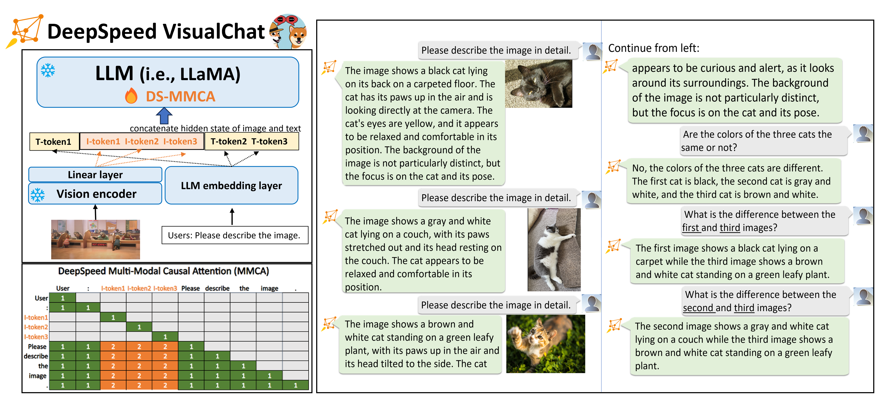

# DeepSpeed-VisualChat

An easy-to-use, scalable, and efficient multi-modal training pipeline for multi-round multi-image interleave chat experience.


## Table of Contents

- [📰 Latest News 📰](#-latest-news-)
- [🚀 What is DeepSpeed-VisualChat 🚀️](#-what-is-deepspeed-visualchat-)
- [⚓ Get Started, Tutorial, and Documentation ⚓](#-get-started-tutorial-documentation-)
- [🌱 DeepSpeed-VisualChat's Roadmap 🌱](#-deepspeed-visualchats-roadmap-)
- [💬 DeepSpeed-VisualChat and DeepSpeed Community 💬](#-deepspeed-visualchat-and-deepspeed-community-)
- [🙏 Acknowledgement and Citation 🙏](#-acknowledgement-and-citation-)

<!-- markdown-toc end -->

## 📰 Latest News 📰

* ***[2023/10] [DeepSpeed-VisualChat: Improve Your Chat Experience with Multi-Round Multi-Image Inputs](https://github.com/microsoft/DeepSpeed/tree/master/blogs/deepspeed-visualchat/10-03-2023/README.md)***

⭐ If you find our [DeepSpeed](https://github.com/microsoft/DeepSpeed) and [DeepSpeedExamples](https://github.com/microsoft/DeepSpeedExamples) repositories beneficial, please give them a star on GitHub! To cite DeepSpeed-VisualChat, please cite our [arxiv report](https://arxiv.org/abs/2309.14327):

```
@article{yao2023deepspeed-visualchat,
  title={{DeepSpeed-VisualChat: Multi-Round Multi-Image Interleave Chat via Multi-Modal Causal Attention}},
  author={Zhewei Yao and Xiaoxia Wu and Conglong Li and Minjia Zhang and Heyang Qin and Olatunji Ruwase and Ammar Ahmad Awan and Samyam Rajbhandari and Yuxiong He},
  journal={arXiv preprint arXiv:2309.14327},
  year={2023}
}
```

## 🚀 What is DeepSpeed-VisualChat 🚀
<div align="center">


Figure 1. On the left is a DeepSpeed-VisualChat model, featuring an innovative attention design. On the right is an example of DeepSpeed-VisualChat.

</div>

---

With increasing interest in enabling the multi-modal capabilities of large language models, DeepSpeed is proud to announce a new training pipeline, named ***DeepSpeed-VisualChat***. This is designed for enabling a multi-round, multi-image interleave chat framework. It enhances the language model with image understanding and reasoning capabilities. Unlike the majority of open-sourced multi-modal projects, the primary focus of DeepSpeed-VisualChat is to provide a multi-round, multi-image interleave chat experience, as illustrated in Figure 1.

To improve model quality without introducing new parameters, DeepSpeed-VisualChat incorporates a new multi-modal causal attention mechanism, which is adept at better aligning visual and text features. Additionally, to overcome the scarcity of interleaved text-and-image inputs in most available open-sourced datasets, we employ various data blending techniques on existing datasets.

Thanks to the scalable, efficient, and user-friendly nature of the DeepSpeed ecosystem, we have the capability to train using a 2B visual encoder from QWen-VL (one is additionally refined from OpenClip) and a 70B language decoder from LLaMA-2. This showcases the extraordinary scalability of the DeepSpeed-VisualChat framework.


## ⚓ Get Started, Tutorial, and Documents ⚓

### 🐼 Installation


```bash
git clone https://github.com/microsoft/DeepSpeedExamples.git
cd DeepSpeedExamples/applications/DeepSpeed-VisualChat/
pip install -r requirements.txt
```

### 🐼 Datasets Preparation

Table below summarizes where to download the datasets that we support. `{data_path}` denotes the `--data_path` argument provided in training scripts.

| Dataset name | Where to download |
|--------------|-------------------|
| aokvqa | Download `2017 Train images [118K/18GB]` from [https://cocodataset.org/#download](https://cocodataset.org/#download) and save at `{data_path}/coco/train2017/`. Download `aokvqa_v1p0_train.json` from [https://allenai.org/project/a-okvqa/home](https://allenai.org/project/a-okvqa/home) and save at `{data_path}/aokvqa/annotations/`. |
| coco_caption | Download 2014 Train images and 2014 Val images from [https://cocodataset.org/#download](https://cocodataset.org/#download) and save all images at `{data_path}/coco/2014/`. Download `dataset.json` from [https://cs.stanford.edu/people/karpathy/deepimagesent/coco.zip](https://cs.stanford.edu/people/karpathy/deepimagesent/coco.zip) and save at `{data_path}/coco_caption/`. |
| llava | Download `2017 Train images [118K/18GB]` from [https://cocodataset.org/#download](https://cocodataset.org/#download) and save at `{data_path}/coco/train2017/`. Download `detail_23k.json` and `complex_reasoning_77k.json` from [https://huggingface.co/datasets/liuhaotian/LLaVA-Instruct-150K](https://huggingface.co/datasets/liuhaotian/LLaVA-Instruct-150K) and save at `{data_path}/llava/`. |
| llava_dial | Download `2017 Train images [118K/18GB]` from [https://cocodataset.org/#download](https://cocodataset.org/#download) and save at `{data_path}/coco/train2017/`. Download `conversation_58k.json` from [https://huggingface.co/datasets/liuhaotian/LLaVA-Instruct-150K](https://huggingface.co/datasets/liuhaotian/LLaVA-Instruct-150K) and save at `{data_path}/llava/`. |
| llava_otter_blend | Follow instructions of the llava, llava_dial, and otter_mimicit_cgd datasets. |
| minigpt4 | Download `image` folder and `filter_cap.json` from [https://huggingface.co/datasets/Vision-CAIR/cc_sbu_align](https://huggingface.co/datasets/Vision-CAIR/cc_sbu_align) and save at `{data_path}/cc_sbu_align/`. |
| ocr_vqa |  Download `images` folder and `dataset.json` from [https://ocr-vqa.github.io/](https://ocr-vqa.github.io/) and save at `{data_path}/OCR_VQA/`. |
| otter_mimicit_cgd | Download `2017 Train images [118K/18GB]` from [https://cocodataset.org/#download](https://cocodataset.org/#download) and save at `{data_path}/coco/train2017/`. Download `CGD_instructions.json` from [https://huggingface.co/datasets/pufanyi/MIMICIT](https://huggingface.co/datasets/pufanyi/MIMICIT) and save at `{data_path}/MIMIC-IT/`. |
| otter_mimicit_sd | Download `SD.json` and `SD_instructions.json` from [https://huggingface.co/datasets/pufanyi/MIMICIT](https://huggingface.co/datasets/pufanyi/MIMICIT) and save at `{data_path}/MIMIC-IT/`. |
| otter_mimicit_sn | Download `SN.json` and `SN_instructions.json` from [https://huggingface.co/datasets/pufanyi/MIMICIT](https://huggingface.co/datasets/pufanyi/MIMICIT) and save at `{data_path}/MIMIC-IT/`. |
| otter_mimicit_tvc | Download `TVC.json` and `TVC_instructions.json` from [https://huggingface.co/datasets/pufanyi/MIMICIT](https://huggingface.co/datasets/pufanyi/MIMICIT) and save at `{data_path}/MIMIC-IT/`. |
| otter_mimicit_vst | Download `VST.json` and `VST_instructions.json` from [https://huggingface.co/datasets/pufanyi/MIMICIT](https://huggingface.co/datasets/pufanyi/MIMICIT) and save at `{data_path}/MIMIC-IT/`. |
| sparkles_dialogue | Download the `SparklesDialogueCC` and `SparklesDialogueVG` folders from the OneDrive link from [https://github.com/HYPJUDY/Sparkles](https://github.com/HYPJUDY/Sparkles) and save at `{data_path}/`. |

### 🐼 Training, Evaluation, Chat API, and Helper
Please refer to 
  - [**Training**](./training/README.md)
  - [**Evaluation**](./eval/README.md)
  - [**Chat**](./chat/README.md)
  - [**Helper**](./helper/README.md)


## 🌱 DeepSpeed-VisualChat's Roadmap 🌱

Our future plan includes but not limited to :
- [ ] Support more models
- [ ] Demonstrate how to training larger models with higher model quality

## 💬 DeepSpeed-VisualChat and DeepSpeed Community 💬

Just like how the success of [the BLOOM model](https://huggingface.co/bigscience/bloom) was supported by both [DeepSpeed Team](https://github.com/bigscience-workshop/Megatron-DeepSpeed) and many [open source contributors](https://huggingface.co/bigscience), we welcome all AI developers/practitioners/researchers to join this on-going effort for DeepSpeed-Chat. To participate:
- Show your support by leaving a star ⭐ to our [DeepSpeed](https://github.com/microsoft/DeepSpeed) and [DeepSpeedExamples](https://github.com/microsoft/DeepSpeedExamples) GitHub repositories.
- Follow us on [twitter](https://twitter.com/MSFTDeepSpeed) to get notified about our latest news. For Chinese users, you can also follow our [Chinese Zhihu account](https://www.zhihu.com/people/deepspeed). For Japanese users, you can also follow our [Japanese twitter account](https://twitter.com/MSFTDeepSpeedJP).
- Currently we prefer to interact with open source users mainly on GitHub so that it's easier for all users to search for related information. For bug reports, please submit a GitHub issue. For contribution, please submit a pull request (PR). For general question/discussion, please open a new discussion or join any existing discussions.
- We are open to collaborations with universities, research labs, and companies, such as working together on deep learning research, applying DeepSpeed to empower real-world AI models and applications, and so on. For such requests (and other requests unsuitable for GitHub), please directly email to deepspeed-info@microsoft.com.


## 🙏 Acknowledgement and Citation 🙏

We thank the following papers and open-source repositories:

    [1] LLaVa, https://github.com/haotian-liu/LLaVA
    [2] Otter, https://github.com/Luodian/Otter
    [3] Transformers Hugging Face, https://github.com/huggingface/transformers
    [4] MiniGPT4, https://github.com/Vision-CAIR/MiniGPT-4
    [5] QWen-VL, https://github.com/QwenLM/Qwen-VL
    [6] Sparkles, https://github.com/HYPJUDY/Sparkles
    [7] Multimodal-GPT, https://github.com/open-mmlab/Multimodal-GPT
