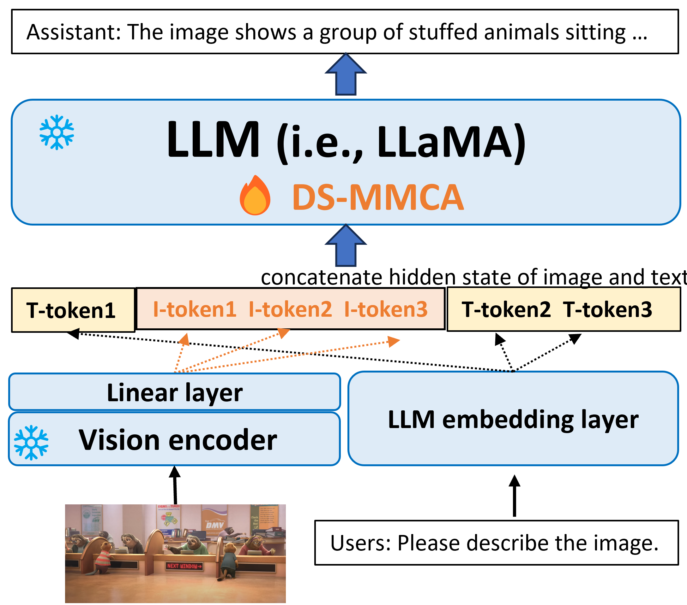
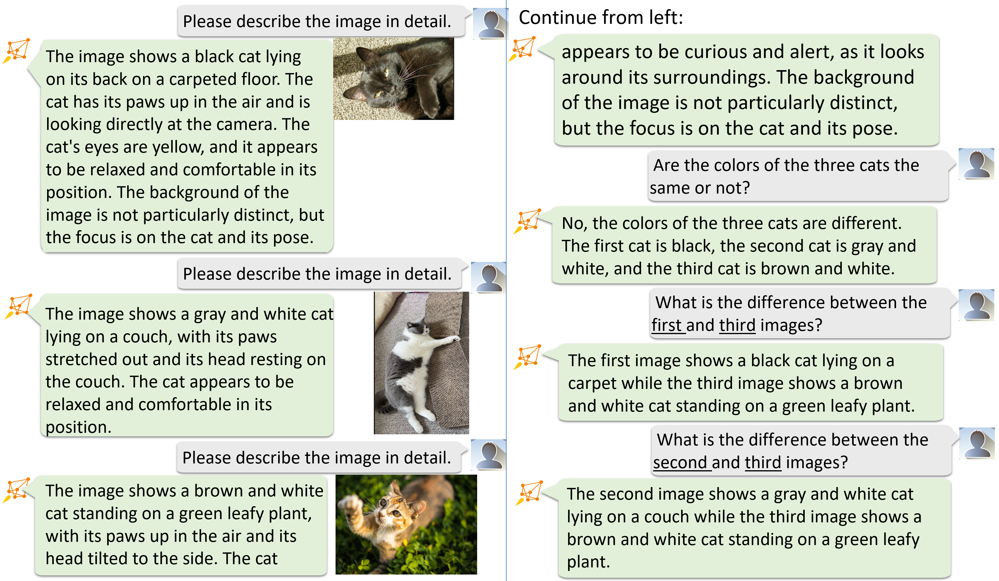

<div align="center">



</div>

# 🐕 Vision-Lanauge Finetuning
Vision-Lanauge finetuning (or insturction finetuning) is very similar to standard large language model finetuning. The differences are summarized as follows:
* It requires an extra vision encoder
* It requires high quality text-image data pairs
* It needs a linear projection layer that connects the visual encoder and LLM


## 🏃 How to train the model
Remember to prepare you data first based on [tutorial](../README.md). If you want to use 448x448 resolution images, you need go to [helper](../helper) for more information. Otherwise, you can simply run
```bash
 training_scripts/run_7b.sh
 ```

which shows an example to fine-tune a LLaMA-2-7B LLM together with a CLIP-large visual encoder and a linear projection layer that connects this visual encoder and LLM.


## 👀 A few examples
Please refer to [Chat](../chat/README.md) or [Eval](../eval/README.md) for evaluation. 

<div align="center">

</div>

-----

<div align="center">

</div>

------

<div align="center">

</div>
