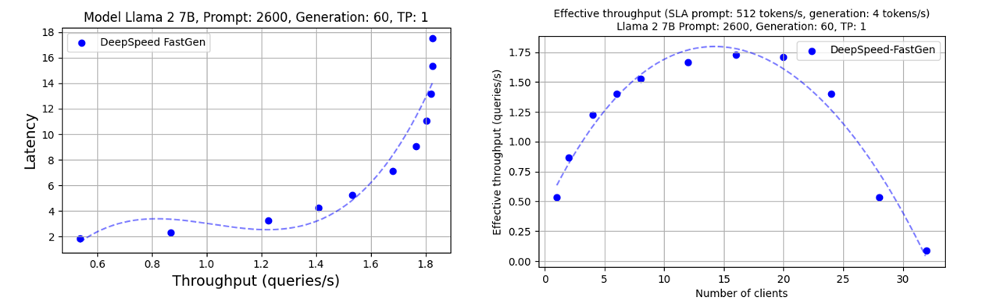

# Inference Benchmarking Scripts for vLLM, DeepSpeed-FastGen, and Azure ML endpoints

## Run the Benchmark

The benchmarking scripts use DeepSpeed-FastGen in the persistent mode. You can
run the benchmark using `run_benchmark.py`. This script will run several
combinations of inference servers and clients with different tensor parallel
size, number of model replicas (MII only), number of clients, prompt length, and
max new tokens values. By default, the benchmark will run with the `meta-llama/Llama-2-7b-hf` model.

```bash
python run_benchmark.py
```

Use the -h option to view all available options. Several models have pre-defined
default values, including `meta-llama/Llama-2-{7|13|70}b-hf`,
`tiiuae/falcon-{40|180}B`, `microsoft/phi-2`, and `mistralai/Mixtral-8x7B-v0.1`.
These defaults can be overridden if provided to the `run_benchmark.py` script.
For example, to run `meta-llama/Llama-13b-hf` with a tensor parallel size of `1`
and `2` (instead of the default `1`, `2`, and `4`):

```bash
python run_benchmark.py --tp_size 1 2
```

By default the benchmark runs with DeepSpeed-MII as the backend inference
server. The benchmark also supports vLLM and Azure endpoints. To change the
backend to vLLM, provide the `--backend vllm` arg:

```bash
python run_benchmark.py --backend vllm
```

To benchmark against an Azure endpoint, provide the `--backend aml` as well as
the following values:
- `--aml_api_url`: API URL that points to an AML endpoint
- `--aml_api_key`: API key for the given AML endpoint
- `--deployment_name`: The name of the AML endpoint deployment you want to test against
- `--model`: The name of the HuggingFace-hosted model deployed on the AML endpoint. This is used to load a tokenizer and correctly calculate the number of tokens in the prompts and responses.

```bash
python run_benchmark.py --backend aml --model mistralai/Mixtral-8x7B-v0.1 --deployment_name mistralai-mixtral-8x7b-v01-4 --aml_api_url <URL obtained from Azure> --aml_api_key <Authentication key obtained from Azure>
```

The run_all.sh script performs benchmarks across various models, client numbers,
tensor parallel sizes, etc. This script is intended to be run on a system with
8xA100 (80GB) GPUs available. It will run all the benchmarks (including vLLM)
and collect the data used in our [DeepSpeed-Fastgen
blogs](https://github.com/deepspeedai/DeepSpeed/tree/master/blogs/deepspeed-fastgen).
Results are collected in `./results/`.

## Analyze the Benchmark Results

The scripts mentioned below were used for generating the plots featured in our
blog. Specify the root directory for log files using `--log_dir` and the backends you wish to run for, e.g. `--backend vllm fastgen aml`. The generated
figures will be saved to `./plots/`

- `src/plot_th_lat.py`: This script generates charts for throughput and latency across different model sizes and client counts.
- `src/plot_effective_throughput.py`: Use this to chart effective throughput.
- `src/plot_latency_percentile.py`: This script will plot the 50th, 90th, and 95th percentile latencies.
- `src/plot_repl_scale.py`: This script will plot the throughput and number of replicas for a fixed clients/replica per plot.
- `src/plot_tp_sizes.py`: This script will plot latency and TFLOPs per GPU across different tensor parallelism sizes.

## Throughput Latency Plot Generation Script
The `plot_th_lat.py` throughput-latency plot generation script is generalized for any result output directory, irrespective of where it was run.

The script uses an **_optional_** `plot_config.yaml` that resides within each result directory and allows for overrides in the plot formatting. An example config file may look like this:
```yaml
label: "vLLM"
color: "purple"
marker: "o"
linestyle: "--"
polyfit_degree: 0
x_max : 30
y_max : 10
```

Each of the config parameters is optional, allowing for overriding of only the specific plot aspects required, however, all parameters may also be provided.

A few nuances for the `polyfit_degree` and `x/y_max` parameters:
- `polyfit_degree`: Specifies the polynomial degree for the 'best fit line'. Specifying `0` removes the best fit line and simply connects the scatter plot points.
- `x/y_max`: Clips the x or y axis data using the specified value as the upper bound.

An example command executing the script may look something like this:
```bash
DeepSpeedExamples/benchmarks/inference/mii$ python3 src/plot_th_lat.py --data_dirs ./results/results-* --model_name <plot_model_title>
```

Or each result directory can be enumerated explicitly:
```bash
DeepSpeedExamples/benchmarks/inference/mii$ python3 src/plot_th_lat.py --data_dirs ./results/results-1 ./results/results-2 ./results/results-3 --model_name <plot_model_title>
```

## Running an End-to-End Example

To quickly experience the end-to-end process of running our benchmark and
getting results, you can use the `run_example.sh`. This script is designed to
execute the benchmark with a specific configuration. The plots below will be
generated in the `./plots/` directory. These plots show the performance as
depicted in figure 8 of our blog
[post.](https://github.com/deepspeedai/DeepSpeed/tree/master/blogs/deepspeed-fastgen#f-other-hardware-platforms)
	   
```bash
bash run_example.sh
```

<div align="center">
  <br>

  *Figure 1: Throughput-latency curve and effective throughput of Llama 2 7b using A6000. Runs the client with 60 generation steps and input prompt length of 2600.*<br>
</div>
