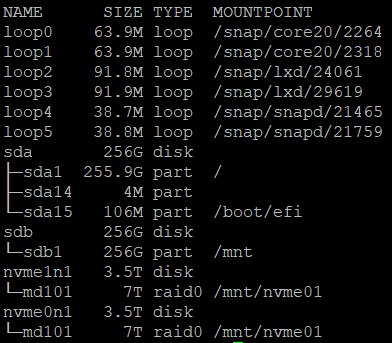

# Using DeepNVMe for ZeRO-Inference
ZeRO-inference is an ideal use case for the DeepNVMe technology. When you have a model that exceeds the size of availabe GPU memory the [DeepNVMe](https://github.com/microsoft/DeepSpeed/blob/master/blogs/deepspeed-gds/README.md) library along with ZeRO-inference can be leveraged for high-throughput offline inference. 

Maximizing inference in this scenario has two parts. First offloading the model parameters to fast Non-Volatile Memory, either a single device or several devices RAIDed together to further increase the effective bandiwidth of the system. These parameters are then swapped into the GPU memory layer by layer to compute the forward pass for inference. This allows for the second part of the process, maximizing the batch size. By swapping in parameters layer by layer the remaining GPU memory can be used by the computational batch which leads to a maximizing of total inference throughput.

## Testing Environment
The environment for these tests was a VM with NVIDIA Magnum IO<sup>TM</sup> GPUDirect® Storage (GDS) installed along with a single NVIDIA H100 GPU containing 96 GB of memory. The VM also had two NVMes each with a read bandwidth of ~6 GB/sec. The two NVMes were put into a RAID0 configuration, bringing the effective read bandwidth up to ~12 GB/sec. 
<div align="center">
    
</div> 

## Initial Results
The following models where run from the folder DeepSpeedExamples/inference/huggingface/zero_inference using disk-offload of parameters via the following command:

```bash
deepspeed --num_gpus 1 run_model.py --model $model_name --batch_size $bsz --prompt-len 512 --gen-len 32 --disk-offload $path_to_foler --use_gds
```

Where `--use_gds` is set to enable NVIDIA GDS and move parameters directly between the NVMe and GPU, otherwise an intermediate CPU bounce buffer will be used to move the parameters between the NVMe and GPU.

All models tested were chosen so they could not fit into 96 GB of GPU memory.

GDS | OPT-66B | Llama3-70B | Bloom-176B  
|---|---|---|---|
False | 3.156(bsz=32) | 8.606(bsz=96) | 0.291(bsz=8) |
True | 2.321(bsz=24) | 8.876(bsz=96) | 0.293(bsz=8) |

Throughput measured in tokens/sec.

## Batch Size Differences in OPT-66B
In 2 of the 3 model scenarios above GDS outperformed the CPU bounce buffer on throughput. In the OPT-66B scenario the CPU buffer performed better because it was able to accomodate a larger batch size (32 vs 24). This is a result of how parameter swapping is implemented when using GDS. The CPU keeps its bounce buffer for parameters in CPU DRAM, GDS must also keep a bounce buffer in GPU VRAM. This extra space taken up in GPU VRAM by the GDS bounce buffer has the possiblity of causing an Out-of-Memory error when scaling to larger batch sizes.
