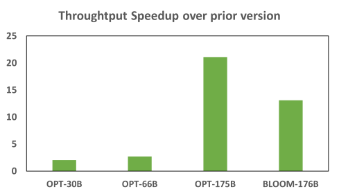

# ZeRO-Inference: 20X faster inference through weight quantization and KV cache offloading

ZeRO-Inference enables inference computation of massive models (with hundreds of billions of parameters) on as few as a single GPU by leveraging multi-level hierarchical memory (e.g., GPU, CPU, and NVMe). It delivers efficient computation for `throughput-oriented` inference scenarios despite the latency of fetching model weights from CPU memory or NVMe over PCIe interconnect. We [previewed](https://github.com/microsoft/DeepSpeed/pull/1514) this AI democratization technology in late 2021, and followed up in 2022 with a [paper](https://arxiv.org/abs/2207.00032) and [blog](https://www.deepspeed.ai/2022/09/09/zero-inference.html) describing the first full-feature release in [DeepSpeed versions >= 0..6.6](https://github.com/microsoft/DeepSpeed/tree/v0.6.6). We have been continuously pushing out usability and performance updates ever since, and are pleased to announce a major refresh of this popular DeepSpeed feature. This new release leverages two memory optimizations (weight quantization and KV cache offloading) to deliver up to 20X speedup in inference throughput, and is available in [DeepSpeed versions >= 0.10.2](). 

This repo is used to showcase ZeRO-Inference's capability of serving economic cases for large generative models. For these models, the major memory consumption originates from model weights and KV cache, limiting the maximum batch size (thus throughput) that can be used in inference. ZeRO-Inference now supports 4-bit quantization of model weights, leading to approximately $4\times$ reduction on its memory usage. This is a generic feature and is model agnostic (requiring no model change). The highly efficient quantization/dequantization kernels have been integrated into the DeepSpeed framework. Additionally, KV cache, as the other limiting factor of improving system throughput, can be offloaded to CPU for computation (e.g.,cpu-cache-compute).
Using publically available OPT and BLOOM models as examples, we demonstrate how KV cache CPU offloading can be easily enabled for all Hugging Face models through our recipe. Refer to [models](models) for details.

With these two added techniques, we show the significant throughput and batch size improvements of this new ZeRO-Inference release over the previous one. We further show that ZeRO-Inference achieves comparable token generation throughput to the SOTA throughput-oriented inference frameworks.
Unlike [FlexGen](https://github.com/FMInference/FlexGen) which requires from-scratch model implementation with their APIs, ZeRO-Inference requires `NO` code change for `4-bit` weight quantization and offloading (integrated to DeepSpeed inference framework), and only minor changes to the model code for KV cache offloading.

We plan to release more performance improvements to ZeRO-Inference, such as partial offloading, KV cache quantization, and etc, in the near future. Please check the [Working-In-Progress](#working-in-progress) list and stay tuned.

## Install

The Python dependencies are captured in `requirements.txt`. Note that to enable KV cache offloading, use our [fork of transformers](https://github.com/cli99/transformers/tree/kvcache-offload-cpu), you can install it by `pip install git+https://github.com/cli99/transformers@kvcache-offload-cpu` or running

```sh
pip install -r requirements.txt
```
The model changes are detailed in [`model-support.md`](model-support.md).

## Usage

We provide [`run_model.py`](run_model.py) as the entry script to run ZeRO-Inference. Run
```sh
python run_model.py --help
```
For help on what options are available, please refer to [`run_model.sh`](run_model.sh) for more example scripts.

## Token Generation with ZeRO-Inference

### Example 1: OPT Models

Here is an example of running the `facebook/opt-13b` model with Zero-Inference using model weights and kv cache cpu offloading:

```sh
deepspeed --num_gpus 1 run_model.py --model facebook/opt-13b --batch-size 8 --prompt-len 512 --gen-len 32 --cpu-offload --kv-offload
```

To enable 4-bit weight quantization, use `--quant-bits 4`. Quantization group size is default to be `64` and can be configured through the `--group-size` flag.

```sh
deepspeed --num_gpus 1 run_model.py --model facebook/opt-13b --batch-size 16 --prompt-len 512 --gen-len 32 --cpu-offload --kv-offload --quant-bits 4
```

### Example 2: BLOOM Models

Here is an example of running `bigscience/bloom-7b1` with Zero-Inference using model weights and kv cache cpu offloading:

```sh
deepspeed --num_gpus 1 run_model.py --model bigscience/bloom-7b1 --batch-size 8 --prompt-len 512 --gen-len 32 --cpu-offload --kv-offload
```

## Benchmarking

### 😽 Overall Throughput Improvement of new ZeRO-Inference release 😽

<p align="center">



 Figure 1: Zero-Inference throughput improvement (speedup) over the previous version for performing throughput-oriented inference on various model sizes on a single NVIDIA A6000 GPU. `NVIDIA A6000 GPU` with 48GB device HBM and 252GB host CPU memory, 252GB host CPU memory with disk throughput of 3200 MB/s sequential reads; prompt=512, gen=32. The significant throughput originates from our faster generation kernel design, KV cache offloading and hybrid computation, as well as efficient weight compression.

</p>


### 🐼 Comparison with SOTA Throughput-Oriented Inference Framework 🐼

For fairness, we selected the same features supported by both FlexGen and our ZeRO-Inference for performance comparison, including KV cache offloading and weight compression (i.e., INT4). Each data point is described using the format of | `throughput` (`batch size` on the last level of memory hierarchy)|. Throughput is measured by `tokens/sec`.

Configuration 1: `NVIDIA A6000 GPU` with 48GB HBM; 252GB host CPU memory with disk throughput of 3200 MB/s sequential reads; prompt=512, gen=32.

Framework   | KV Offload | Weight Compression | OPT-30B  | OPT-66B  | OPT-175B  |
|---|---|---|---|---|---|
| FlexGen  | Yes | No | 13.24 (200 on CPU) | 4.15 (80 on CPU) | 0.34 (64 on disk, KV on CPU) |
| FlexGen with Compression | Yes | Yes | 13.40 (280 on CPU) | 6.24 (96 on CPU) | 1.84 (40 on CPU)|
| DeepSpeed ZeRO-Inference | Yes | No  |  12.50 (128 on CPU) | 3.40 (40 on CPU)  | 0.38 (32 on disk, KV on CPU) |
| DeepSpeed ZeRO-Inference with Compression | Yes | Yes | 17.20 (156 on CPU) | 7.30 (64 on CPU) | 2.11 (24 on CPU) |


Configuration 2: `NVIDIA T4 GPU` with 16GB HBM; 208GB host CPU memory with disk throughput of 1200 MB/s; prompt=512, gen=32.

Framework   | KV Offload | Weight Compression | OPT-30B  | OPT-66B  | OPT-175B  |
|---|---|---|---|---|---|
| FlexGen | Yes | No  | 6.40 (96 on CPU)  |  2.31 (48 on CPU) | 0.14 (64 weight on disk, KV on CPU)  |
| FlexGen with Compression | Yes | Yes | 6.52 (96 on CPU)  | 3.06 (80 on CPU)  | 0.77 (32 on CPU)  |
| DeepSpeed ZeRO-Inference | Yes | No | 2.80 (56 on CPU)  | 0.67 (24 on CPU)  |  0.08 (24 weight on disk, KV on CPU) |
| DeepSpeed ZeRO-Inference with Compression | Yes | Yes |  5.60 (64 on CPU) | 2.45 (48 on CPU)  |  0.54 (16 on CPU) |


## Performance Tuning Tips

- While using pinned CPU memory does speed up the offloading data transfer rate, the amount of pinned memory available on a system is much less than the total CPU memory, thus limiting the maximum batch size that can be run. To see if it helps improve the overall performance on your system, use `--pin-memory ` to enable it. By default, pinned memory is not enabled.

- When using CPU offloading, the optimal batch size for best throughput on a system is not necessarily the maximum batch size one can achieve since the system performance can drop when CPU memory is under pressure.


## Working-In-Progress

The following features/improvements are part of our work-in-progress. Please stay tuned :smile:

- [ ] KV cache quantization
- [ ] Partial model weights/KV cache offloading
- [ ] Compute/IO scheduling for maximum overlapping and reuse
- [ ] Generalizing model support without any client-side change

## How to Enable INT4 Weight Quantization in ds_config

INT4 weight quantization can be easily enabled with a few lines of configuration change in your ds_config. ZeRO-Inference engine will automatically identify all candidate layers and convert their weight tensors into INT4. Currently, we support 2 modes: quantized initialization and post initialization quantization.

### Quantized Initialization
This is the easiest way to getting started. By providing a few lines of hints in ds_config, the model will be on-the-fly quantized during model initialization (e.g., AutoModel.from_pretrained). All candidate layers will be automatically quantized.
```
ds_config = {
  'weight_quantization': {
      'quantized_initialization': {
          'num_bits': 4,
          'group_size': 64,
          'group_dim': 1,
          'symmetric': False
      },
  }
}
with torch.no_grad():
  hfds_config = HfDeepSpeedConfig(ds_config)
  # Now model is on-the-fly quantized.
  model = AutoModel.from_pretrained('facebook/opt-66b')
```
Currently, ZeRO-inference can quantize the weight matrix of nn.Embedding and nn.Linear into INT4 format. In the example above, we applied group_size=64 and performed asymmetric quantization on the 1st dimension of the weight matrix. `group_size` here is configurable based on users' demand.

### Post Initialization Quantization
In this mode, model is first loaded in FP16 format and then convert into INT4. The advantage of enabling this mode is that users will have an overview of the model architecture. Thus, they will have fine-grained control over the quantization decision. For example, which layer should be quantized with which quantization configuration can be controlled. Only a few lines of code changes are needed. Note that we plan to expand this mode to accommodate more formats in the near future.
```
from deepspeed.compression.inference.quantization import _init_group_wise_weight_quantization
ds_config = {
  'weight_quantization': {
    'post_init_quant': {
      'fc': {
          'num_bits': 4,
          'group_size': 64,
          'group_dim': 1,
          'symmetric': False
      },
      'self_attn.q_proj': {
          'num_bits': 4,
          'group_size': 64,
          'group_dim': 1,
          'symmetric': False
      },
    }
  }
}

with torch.no_grad():
  hfds_config = HfDeepSpeedConfig(ds_config)
  # Model is loaded in FP16
  model = AutoModel.from_pretrained('facebook/opt-66b', torch_dtype=torch.float16)
  # Convert to INT4
  model = _init_group_wise_weight_quantization(model, ds_config)
  ds_engine = deepspeed.initialize(model=model, config_params=ds_config)[0]
  ds_engine.module.eval()
  model = ds_engine.module
```

In running example above, only two fully connected layers (fc1 and fc2) and the attention query projection (q_proj) will be converted into INT4.

## References

- DeepSpeed [ZeRO-Inference](https://www.deepspeed.ai/2022/09/09/zero-inference.html)
- Shen, Sheng, et al. "Q-bert: Hessian based ultra low precision quantization of bert." Proceedings of the AAAI Conference on Artificial Intelligence. Vol. 34. No. 05. 2020.
