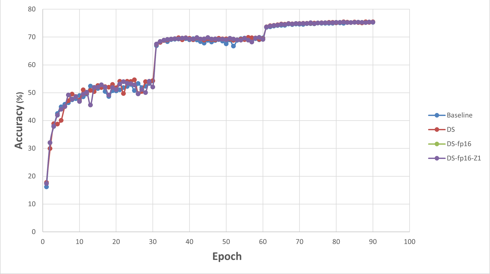

# ImageNet training with DeepSpeed

This example activated DeepSpeed on the implementation of training a set of popular model architectures on ImageNet dataset. The models include ResNet, AlexNet, and VGG, and the
baseline implementation could be found at pytorch examples [Github repository](https://github.com/pytorch/examples/tree/main/imagenet). Parts of this README is also borrowed from the original repo. DeepSpeed activation allows for ease in
running the code in distributed manner, allowing for easily applying fp16 quantization benefitting Zero stage1 memory reduction.

## DeepSpeed Optimizations

Applying fp16 quantization and Zero stage 1 memory optimization we were able to reduce the required memory. The table bellow summarizes the results of running resnet 50 on a DGX-1
node (with 16 V100 GPUs):

| Optimization level | Allocated Memory (GB) | Mem. Consumption Improvement (%) |
|-------------------|-------------------|---------|
|Baseline | 1.66 | -|
|DS + fp16 | 1.04 | 37.3|
|Ds + fp16 + Zero 1 | 0.81 | 51.2|

Furthermore, the memory optimization had no adverse impact on accuracy, a point illustrated by the graph below.


## Requirements

- Install PyTorch ([pytorch.org](http://pytorch.org))
- `pip install -r requirements.txt`
- Download the ImageNet dataset from http://www.image-net.org/
  - Then, move and extract the training and validation images to labeled subfolders, using [the following shell script](extract_ILSVRC.sh)

## Training

To train a model, run one of the bash files after setting the model name as well as the path to the ImageNet dataset:
run_ds.sh : baseline code with DeepSpeed activated
run_ds_fp16.sh : fp16 activated
run_ds_fp16_z1.sh: fp16 and Zero1 are activated


The default learning rate schedule starts at 0.1 and decays by a factor of 10 every 30 epochs. This is appropriate for ResNet and models with batch normalization, but too high for AlexNet and VGG. Use 0.01 as the initial learning rate for AlexNet or VGG:


## Use Dummy Data

ImageNet dataset is large and time-consuming to download. To get started quickly, run `main.py` using dummy data by "--dummy". It's also useful for training speed benchmark. Note that the loss or accuracy is useless in this case.


## Usage

```bash
usage: deepspeed main.py [-h] [-a ARCH] [-j N] [--epochs N] [--start-epoch N] [-b N] [--lr LR] [--momentum M] [--wd W] [-p N] [--resume PATH] [-e] [--pretrained] [--world-size WORLD_SIZE]
[--num_gpus NUM GPU] [--num_nodes NUM NODES] [--seed SEED] [--gpu GPU] [--multiprocessing-distributed] [--deepspeed] [--deepspeed_config] [CONFIG FILE] [--dummy] [DIR]


positional arguments:
  DIR                   path to dataset (default: imagenet)
  CINFIG FILE           path to deepspeed config file

optional arguments:
  --deepspeed		activated deepspeed library
  --deepspeed_config    path to the deepspeed config file
  --help, -h            show this help message and exit
  --arch ARCH, -a ARCH  model architecture: alexnet | convnext_base | convnext_large | convnext_small | convnext_tiny | densenet121 | densenet161 | densenet169 | densenet201 | efficientnet_b0 |
                        efficientnet_b1 | efficientnet_b2 | efficientnet_b3 | efficientnet_b4 | efficientnet_b5 | efficientnet_b6 | efficientnet_b7 | googlenet | inception_v3 | mnasnet0_5 | mnasnet0_75 |
                        mnasnet1_0 | mnasnet1_3 | mobilenet_v2 | mobilenet_v3_large | mobilenet_v3_small | regnet_x_16gf | regnet_x_1_6gf | regnet_x_32gf | regnet_x_3_2gf | regnet_x_400mf | regnet_x_800mf |
                        regnet_x_8gf | regnet_y_128gf | regnet_y_16gf | regnet_y_1_6gf | regnet_y_32gf | regnet_y_3_2gf | regnet_y_400mf | regnet_y_800mf | regnet_y_8gf | resnet101 | resnet152 | resnet18 |
                        resnet34 | resnet50 | resnext101_32x8d | resnext50_32x4d | shufflenet_v2_x0_5 | shufflenet_v2_x1_0 | shufflenet_v2_x1_5 | shufflenet_v2_x2_0 | squeezenet1_0 | squeezenet1_1 | vgg11 |
                        vgg11_bn | vgg13 | vgg13_bn | vgg16 | vgg16_bn | vgg19 | vgg19_bn | vit_b_16 | vit_b_32 | vit_l_16 | vit_l_32 | wide_resnet101_2 | wide_resnet50_2 (default: resnet18)
  --workers N, -j N     number of data loading workers (default: 4)
  --epochs N            number of total epochs to run
  --start-epoch N       manual epoch number (useful on restarts)
  --batch-size N, -b N  mini-batch size (default: 256), this is the total batch size of all GPUs on the current node when using Data Parallel or Distributed Data Parallel
  --lr LR, --learning-rate LR
                        initial learning rate
  --momentum M          momentum
  --wd W, --weight-decay W
                        weight decay (default: 1e-4)
  --print-freq N, -p N  print frequency (default: 10)
  --resume PATH         path to latest checkpoint (default: none)
  --evaluate, -e        evaluate model on validation set
  --pretrained          use pre-trained model
  --world-size WORLD_SIZE
                        number of nodes for distributed training
  --local_rank LOCAL_RANK
			node rank for distributed training
  --seed SEED           seed for initializing training.
  --gpu GPU             GPU id to use.
  --num_gpus NUM GPU    Num GPUs to use.
  --num_nodes NUM NODES Num nodes to use
  --multiprocessing-distributed
                        use multi-processing distributed training to launch N processes per node, which has N GPUs. This is the fastest way to use PyTorch for either single node or multi node data parallel
                        training
  --dummy               use fake data to benchmark


Example of running resnet50 on single GPU:
deepspeed --num_nodes=1 --num_gpus=1 main.py -a resnet50 --deepspeed --deepspeed_config config/ds_config.json --dummy

```
